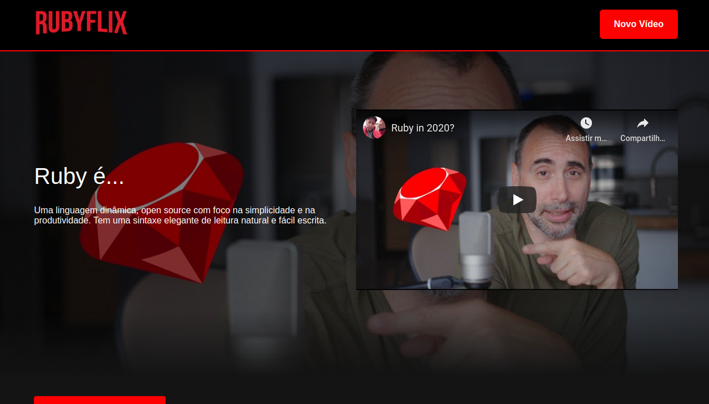

# AULA 01
## React Components e RUBYFLIX



Semana de imersão em React da Alura. O tema de desenvolvimento é o AluraFlix,
um sistema em que podemos listar nossos vídeos favoritos. Alguns desafios propostos
para a primeira aula: 

- Colocar a sua versão da AluraFlix, com o nome que você acha feliz;
- Mudar as cores, logo e tudo mais que te der vontade;
- Alterar os vídeos e categorias com conteúdos que você gosta;
- Compartilhar o resultado que você fez nas redes sociais e quem sabe você aparece no conteúdo extra das aulas.
- **Extra**: Encontrar os easter eggs da Alura no canal do [DevSoutinho](https://youtube.com/c/DevSoutinho) em cada vídeo sugerido nos links importantes das aulas e marcar o [@omariosouto](https://twitter.com/omariosouto) e [@aluraonline](https://twitter.com/aluraonline) no Twitter ou Instagram.

# Requisitos :wrench:

* Node 
* npm ou Yarn 
* npx
* create-react-app

# Instruções :runner:

Clone o projeto no diretório de sua preferência:
```
git clone git@github.com:rcleyton/rubyflix.git
```

Acesse o diretório:
```
cd rubyflix
```

Instalando as dependências:
```
yarn install ou npm install
```
Execuntando a aplicação. Após o comando abaixo, acesse http://127.0.0.1:3000/
```
yarn start ou npm start
```

Parar a aplicação:
```
CTRL + C ou COMMAND + C se estiver no macOS
```

## Link projeto em produção: [RUBYFLIX](https://rubyflix.vercel.app/)